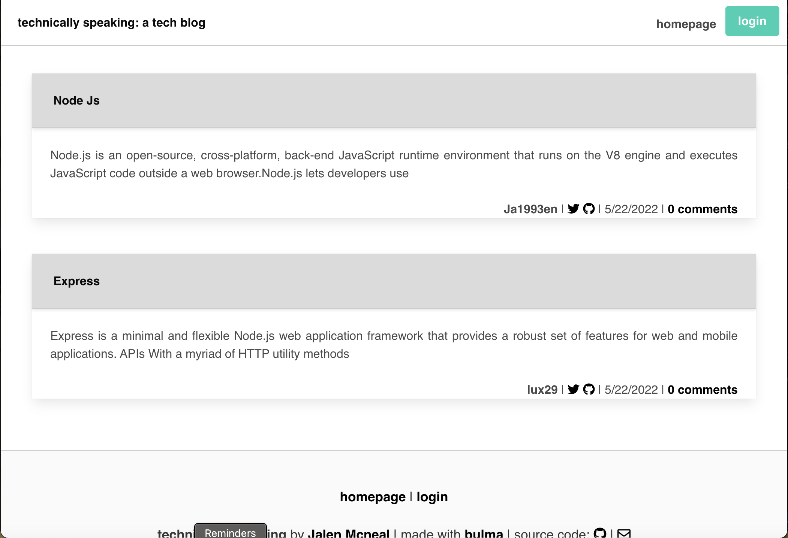

## MVC Tech Blog
   
### Description

*A mysql database and CMS-style Blog built using Model View Controller (MVC) paradigm. Built using MySQL2, Express, Sequelize, Bulma, Handlebars and dotenv*

### Application Deployment

https://git.heroku.com/technology-blog1.git

### Application Screenshot





  
### User Story

```
AS A developer who writes about tech
I WANT a CMS-style blog site
SO THAT I can publish articles, blog posts, and my thoughts and opinions
```

## Support

For support, email mcneal.jalen@yahoo.com


## Authors

- [@ja1993en](https://www.github.com/ja1993en)


### Installation Guidelines

- Add a .env file to the root of the project

```text
DB_NAME='tech_blog_db'
DB_USER='root'
DB_PW='XXX'
```